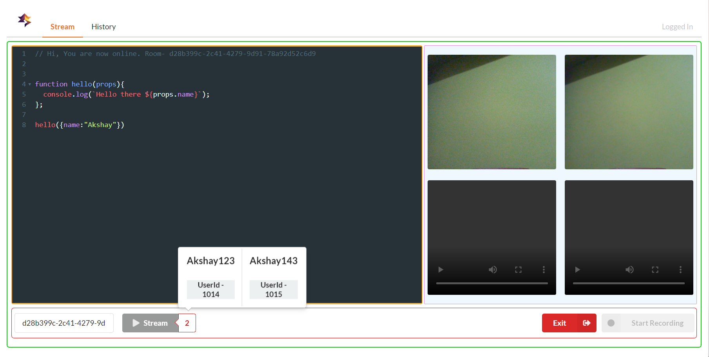

# CodeRealTime
Realtime coding and live streaming App. 

**Starting services**
  * Follow the readme files for service specific instructions (if exists)
  * npm install
  * npm start

Phase 1 - **Completed**
* Live Video Streaming (Max 4 peers)
* Live Code Streaming with node - socket io
* Minimal authentication 
* Layout for Microservices pattern 
  - Code Stream server
  - Video Stream Server
  - Authentication Server 

Phase 2 - 
* OAuth implementation. 
* Stream History Implementation. 
* Improved Authentication.  
* Containerization with docker.  
* Load balancer, Cache server setup. 
* Message Queues* 

# Screenshots 

 

 

 

 

 

 

 

 
